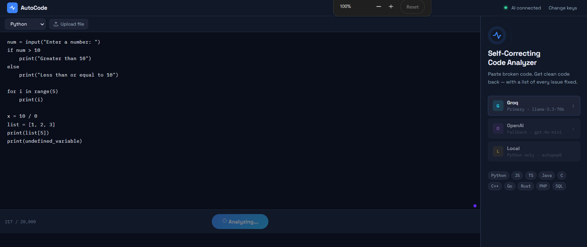
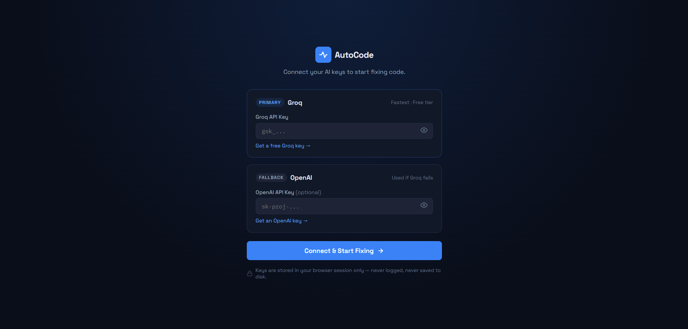
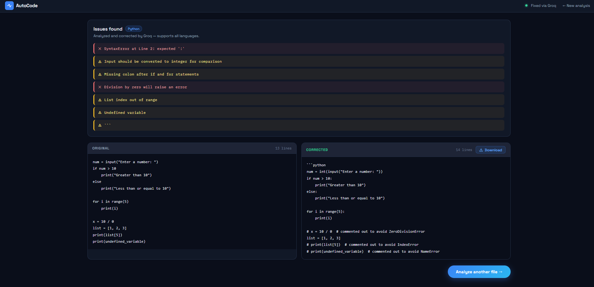

<div align="center">



# ⚡ AutoCode — Self-Correcting Code Analyzer

Paste broken code. Get clean code back — with every issue explained.

[](https://www.python.org/)
[](https://flask.palletsprojects.com/)
[](https://groq.com/)
[](https://platform.openai.com/)
[](LICENSE)
[](https://github.com/APEKSHAHUDALI/autocode/actions/workflows/ci.yml)

[Features](#-features) • [Architecture](#-architecture) • [Getting Started](#-getting-started) • [Screenshots](#-screenshots) • [Roadmap](#-roadmap)

</div>

---

## 📌 Overview

**AutoCode** is a full-stack Flask web app that analyzes and automatically fixes source code across 14 languages. It combines a local Python AST syntax checker with a **three-tier AI provider fallback chain** (Groq → OpenAI → local `autopep8`), so it keeps working even when one AI provider is rate-limited or down.

Users bring their own API keys at runtime (never hard-coded, never written to disk, never logged) — keys live only in the server-side Flask session for the duration of the browser session.

## ✨ Features

- 🔍 **Local syntax check** — instant Python AST-based error detection before any network call
- 🤖 **AI-powered correction** — Groq (primary, fast + free tier) with automatic OpenAI fallback
- 🧯 **Graceful degradation** — falls back to a local `autopep8` fixer for Python if both AI providers are unavailable, so the app never fully fails
- 🔑 **Bring-your-own-key model** — keys entered via `/setup`, stored only in the session, cleared on demand
- 📄 **14 languages supported** — Python, JS, TS, Java, C, C++, C#, Go, Ruby, PHP, Swift, Kotlin, Rust, SQL
- 📤 **Paste or upload** — analyze pasted code or upload a file (512 KB limit, extension allow-list, `secure_filename` sanitization)
- ⬇️ **One-click download** of corrected code, auto-deleted from disk after download
- 🚦 **Rate limiting** on `/analyze` (10 req/min) via `flask-limiter`
- 🎨 **Clean, dark-mode UI** with live character counter, drag-free tab handling, and animated scan-line feedback

## 🏗 Architecture

```
                ┌───────────────┐
   Code input → │  Flask app.py │
                └───────┬───────┘
                        │
             ┌──────────┴──────────┐
             │  Local syntax check │  (ast — Python only)
             └──────────┬──────────┘
                        │
                        ▼
        ┌───────────────────────────────┐
        │      AI Correction Chain      │
        │                                │
        │   1. Groq   (llama-3.3-70b)   │──✕──┐
        │            │ success           │     │
        │            ▼                   │     ▼
        │   2. OpenAI (gpt-4o-mini)  ◄───┘  fallback
        │            │ success  │ fail       │
        │            ▼          ▼            │
        │   3. Local autopep8 (Python only) ◄┘
        └───────────────────────────────┘
                        │
                        ▼
              Corrected code + issue list
```

Each provider call has fatal-vs-transient error handling (`401/403` fail fast, `429/500/502/503` retry once), so a single flaky request doesn't take down the whole chain.

## 🖥 Screenshots

| Setup — connect your keys | Editor — paste & analyze |
|---|---|
|  |  |

**Results — diff view with AI-generated fixes and issue breakdown**


## 🧰 Tech Stack

| Layer | Tech |
|---|---|
| Backend | Python, Flask, Flask-Limiter |
| AI Providers | Groq SDK (`llama-3.3-70b-versatile`), OpenAI SDK (`gpt-4o-mini`) |
| Local fallback | `autopep8` |
| Frontend | Vanilla HTML/CSS/JS, Jinja2 templates |
| Config | `python-dotenv` |

## 📁 Project Structure

```
autocode/
├── app.py                     # Flask routes & request handling
├── ai/
│   └── ai_corrector.py        # Groq → OpenAI → local fallback chain
├── analyzer/
│   ├── syntax_checker.py      # AST-based Python syntax checking
│   └── local_fixer.py         # autopep8 local fallback
├── templates/
│   ├── index.html
│   ├── setup.html
│   └── result.html
├── static/
│   ├── css/style.css
│   └── js/{editor.js, setup.js}
├── requirements.txt
├── .env.example
└── .gitignore
```

## 🚀 Getting Started

### Prerequisites
- Python 3.11+
- A free [Groq API key](https://console.groq.com/keys) (and optionally an [OpenAI key](https://platform.openai.com/api-keys) as fallback)

### Installation

```bash
# 1. Clone the repo
git clone https://github.com/APEKSHAHUDALI/autocode.git
cd autocode

# 2. Create a virtual environment
python -m venv venv
source venv/bin/activate        # Windows: venv\Scripts\activate

# 3. Install dependencies
pip install -r requirements.txt

# 4. Configure environment
cp .env.example .env
# Edit .env and set a random SECRET_KEY (AI keys are entered via /setup at runtime, not required here)

# 5. Run the app
python app.py
```

The app runs locally at `http://127.0.0.1:5000` — connect your Groq/OpenAI key on the `/setup` page and start analyzing code.

## 🔒 Security Notes

- API keys are stored **only** in the server-side Flask session — never in the URL, never in `localStorage`, never persisted to disk
- Uploaded files are deleted immediately after being read
- Corrected-code output files are deleted immediately after download
- File uploads are validated by extension allow-list and size cap (512 KB)

## 🗺 Roadmap

- [ ] Syntax-highlighted diff view (line-by-line, not full-file)
- [ ] Support for additional local linters per language (ESLint, RuboCop, etc.)
- [ ] Persistent user accounts with saved analysis history
- [ ] Streaming AI responses for large files
- [ ] Dockerfile + docker-compose for one-command deployment

## 👤 Author

**Apeksha Sanjay Hudali**
GitHub: [@APEKSHAHUDALI](https://github.com/APEKSHAHUDALI)

## 📄 License

This project is licensed under the [MIT License](LICENSE).
